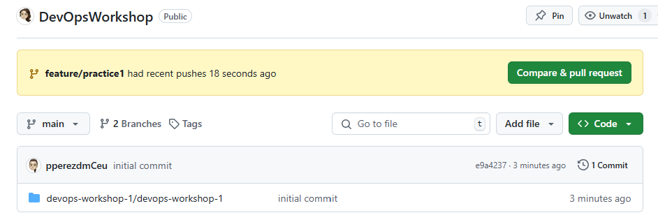
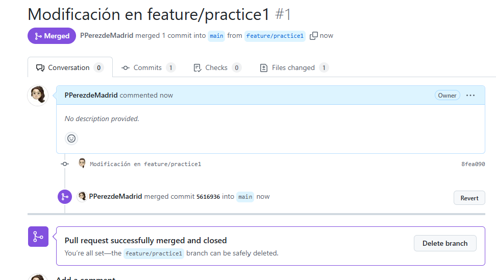

### 1. **Configurar Code Owners**
   El archivo `CODEOWNERS` es el encargado de definir quién es responsable de revisar el código de las diferentes partes del proyecto.

   **Pasos:**
   1. Crea un archivo llamado `CODEOWNERS` dentro del directorio `.github/` de tu repositorio.
   2. Define los responsables del código. Por ejemplo, si todos los archivos del proyecto deben ser revisados por un usuario específico, escribe lo siguiente:

   ```
   * @PPerezdeMadrid
   ```

   Puedes especificar archivos o directorios concretos que diferentes usuarios deben revisar:

   ```
   /src/ @PPerezdeMadrid
   /docs/ @pperezdmCeu
   ```

   Este archivo se asegura de que el usuario o equipo asignado revise cualquier cambio en los archivos o carpetas mencionadas.

### 2. **Configurar un Template de Pull Request**
   Un template de Pull Request ayuda a estandarizar la información que debe incluirse en cada PR.

   **Pasos:**
   1. Crea un archivo llamado `PULL_REQUEST_TEMPLATE.md` en la carpeta `.github/` de tu repositorio.
   2. Define la estructura del PR que deseas. Aquí tienes un ejemplo sencillo:

   ```markdown
   ## Descripción
   Describe brevemente los cambios propuestos en esta Pull Request.

   ## Tipo de cambio
   Marca la opción correcta:

   - [ ] Bugfix
   - [ ] Nueva característica
   - [ ] Refactorización

   ## ¿Cómo se ha probado?
   Describe las pruebas que has realizado para asegurar la calidad del código.

   ## Checklist
   - [ ] Mi código sigue las guías de estilo
   - [ ] He actualizado la documentación cuando es necesario
   - [ ] He añadido pruebas que verifican el cambio
   ```

### 3. **Configurar Protección de la Rama `main`**
   Para proteger la rama `main`, sigue estos pasos desde la interfaz de GitHub:

   1. Ve a la pestaña de **Settings** (Configuración) de tu repositorio.
   2. En el menú lateral izquierdo, selecciona **Branches**.
   3. En la sección **Branch protection rules**, haz clic en **Add rule**.
   4. Define las siguientes reglas:
      - **Branch name pattern**: Especifica `main`.
      - Marca **Require a pull request before merging** para requerir que los cambios pasen por una PR.
      - Marca **Require approvals** y establece que al menos un code owner debe aprobar la PR.
      - Marca **Require status checks to pass before merging** y selecciona los checks que deben pasar.
      - Marca **Include administrators** para aplicar las reglas a los administradores también (opcional).
      - Marca **Do not allow force pushes** para evitar el uso de `force push`.

### 4. **Crear una Feature Branch**
   Para crear una nueva rama (`feature/practice1`), sigue estos pasos en tu terminal:

   ```bash
   git checkout main
   git pull origin main
   git checkout -b feature/practice1
   ```

### 5. **Modificar Archivos**
   Realiza los cambios que desees en la rama `feature/practice1`, por ejemplo, edita un archivo existente o añade un nuevo archivo.

   Luego, añade los cambios y haz commit:

   ```bash
   git add .
   git commit -m "Modificación en feature/practice1"
   ```

   Sube la rama a GitHub:

   ```bash
   git push origin feature/practice1
   ```

### 6. **Crear una Pull Request**
   Ahora que los cambios están en GitHub, puedes crear una Pull Request para fusionar `feature/practice1` a `main`.

   **Pasos:**
   1. Ve a GitHub y abre tu repositorio.
   2. Verás un mensaje sugiriendo crear una Pull Request para la rama `feature/practice1`. Haz clic en **Compare & pull request**.
   3. Completa el formulario de PR usando el template que configuraste previamente.
   4. Una vez que pase la revisión (y todos los checks necesarios), podrás hacer merge.





